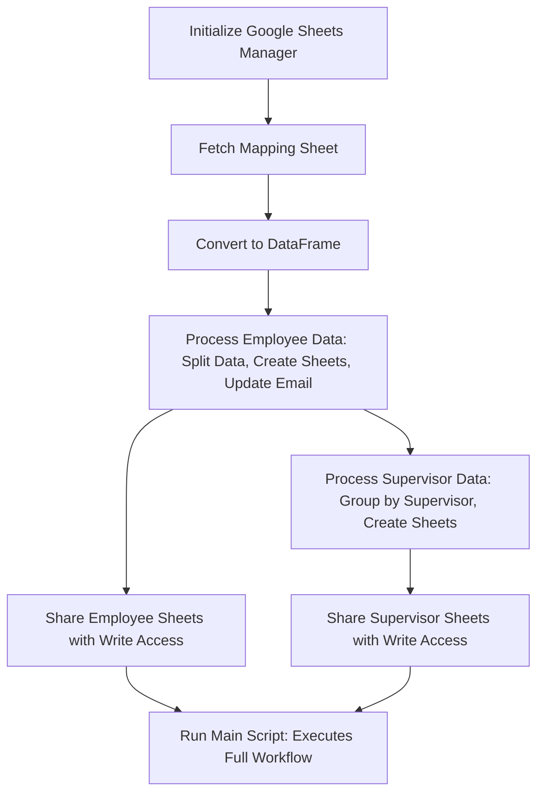

# Google Sheet Automation Project

## Overview

This project automates the process of managing employee and supervisor-related Google Sheets. It creates new sheets for each employee and supervisor, populates them with relevant data, and shares them with the respective users. The project utilizes the Google Sheets API and Google Drive API for sheet management and sharing.


[](https://codespaces.new/concaption/grubhub-reporting/tree/better)

## Features

- Automatically creates individual sheets for employees and supervisors
- Populates sheets with relevant data from a master sheet
- Shares sheets with appropriate access levels
- Handles duplicate sheet names gracefully



## Prerequisites

- Python 3.12.3 or higher
- Google Cloud Platform account with Sheets API and Drive API enabled
- Service account with appropriate permissions

## Installation

1. Clone the repository:
   ```bash
   git clone https://github.com/concaption/grubhub-reporting.git
   cd grubhub-reporting
   ```

2. Create and activate a virtual environment:
   ```bash
   python -m venv venv
   source venv/bin/activate  # On Windows, use `venv\Scripts\activate`
   ```

3. Install the required packages:
   ```bash
   pip install -r requirements.txt
   ```

4. Set up the configuration:
   - Copy `.env.example` to `.env` and fill in the required values
   - Copy `service_account.json.example` to `service_account.json` and fill in your service account details

## Configuration

### Environment Variables

Create a `.env` file in the project root with the following variables:

```
MAPPING_SHEET='Mapping Sheet Name'
EMPLOYEE_TEMPLATE='Template Sheet ID for Employees'
SUPERVISOR_TEMPLATE='Template Sheet ID for Supervisors'
```

### **Environment Variables Description**

-   `MAPPING_SHEET`: The name of the tab in `GH Sample Data` sheet that contains the mapping of employees and supervisors.
-   `EMPLOYEE_TEMPLATE`: The Sheet ID of the template sheet that will be used to create employee sheets.
-   `SUPERVISOR_TEMPLATE`: The Sheet ID of the template sheet that will be used to create supervisor sheets.

### 4. Create `service_account.json` for Google Sheets API

To use the Google Sheets and Google Drive API, you will need a service account and a credentials JSON file.

### Steps to Create `service_account.json`:

1.  Go to the Google Cloud Console.
2.  Create a new project or select an existing one.
3.  Enable **Google Sheets API** and **Google Drive API** for the project:
    -   Navigate to **APIs & Services** > **Library** and search for the APIs.
    -   Click on **Enable** for both APIs.
4.  Create a **service account**:
    -   Navigate to **APIs & Services** > **Credentials** > **Create Credentials** > **Service Account**.
    -   Assign roles like **Editor** or **Viewer** as per your needs.
5.  Download the **JSON** key for the service account:
    -   Once the service account is created, click on it and navigate to the **Keys** section.
    -   Click on **Add Key** > **Create New Key**, select **JSON**, and save the file as `service_account.json` in your project root directory.

### Important:

Ensure the Google Sheets you want to access are shared with the service account's email address (found in the `service_account.json` file).

----------

## Running the Project

1.  Activate the virtual environment:
    
    -   On Windows:
        `venv\Scripts\activate` 
        
    -   On macOS/Linux:
        `source venv/bin/activate` 
        
2.  Run the project:    
    `python main.py`

## Project Structure

```
.
├── main.py                   # Main script to run the project
├── google_sheets.py           # Contains GoogleSheetManager class to manage Google Sheets and Drive
├── custom_functions.py        # Utility functions for processing employee and supervisor data
├── service_account.json       # Google Cloud Service Account credentials
├── .env                       # Environment variables for the project
├── requirements.txt           # Python dependencies

```
----------
## Conclusion

After setting up your virtual environment, installing the dependencies, and configuring the `.env` and `service_account.json` files, you can run the project to automate Google Sheet creation and sharing.

Make sure you follow the steps carefully to avoid any issues with Google API authentication and sheet manipulation.
